# System Architecture

> **Version**: 1.0
> **Last Updated**: 2025-01-27
> **Owner**: Backend Team

## Table of Contents

- [Overview](#overview)
- [Architecture Pattern](#architecture-pattern)
- [Component Diagram](#component-diagram)
- [Layer Responsibilities](#layer-responsibilities)
- [Communication Patterns](#communication-patterns)
- [Data Flow](#data-flow)
- [Technology Choices](#technology-choices)
- [Scalability Considerations](#scalability-considerations)
- [Security Architecture](#security-architecture)

## Overview

The Social follows a **Layered Monolithic Architecture** with clear separation of concerns. The application consists of three main parts:

1. **Backend API**: Spring Boot RESTful API
2. **Mobile Client**: React Native application
3. **Admin Portal**: Next.js web application

## Architecture Pattern

### Layered Monolithic Architecture

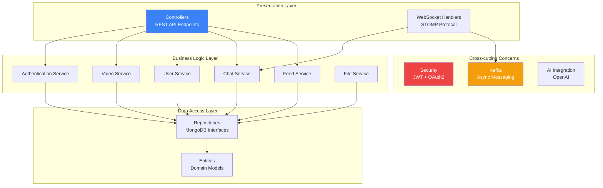

## Component Diagram

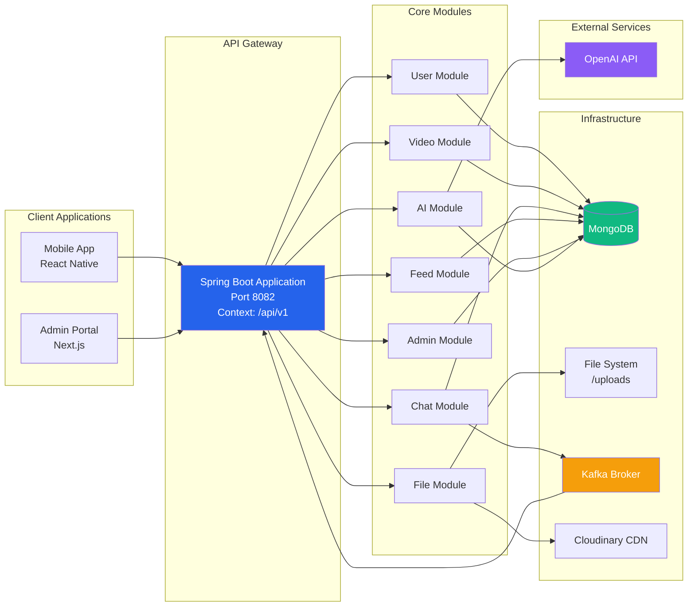

## Layer Responsibilities

### 1. Presentation Layer (Controllers)

**Location**: `com.hehe.thesocial.controller`

**Responsibilities**:

- Handle HTTP requests and responses
- Request validation
- Response mapping
- Error handling delegation
- Authentication/Authorization enforcement

**Key Controllers**:

- `AuthenticationController`: Login, logout, token refresh
- `VideoController`: Video upload, retrieval, management
- `ChatMessageController`: Message CRUD operations
- `ConversationController`: Conversation management
- `UserController`: User profile operations
- `FeedController`: Feed generation and retrieval

### 2. Business Logic Layer (Services)

**Location**: `com.hehe.thesocial.service`

**Responsibilities**:

- Implement business rules
- Transaction management
- Data transformation
- Orchestrate multiple repositories
- Business logic validation

**Key Services**:

- `AuthenticationService`: JWT generation, validation
- `VideoService`: Video processing, thumbnails
- `ChatMessageService`: Message handling, delivery
- `FeedService`: Feed algorithm, aggregation
- `FileService`: File upload, storage management

### 3. Data Access Layer (Repositories)

**Location**: `com.hehe.thesocial.repository`

**Responsibilities**:

- Database operations
- Query optimization
- CRUD operations
- Custom queries

**Repositories**:

- `UserRepository`
- `VideoRepository`
- `ChatMessageRepository`
- `ConversationRepository`
- `FeedItemRepository`
- `FileRepository`

### 4. Domain Models (Entities)

**Location**: `com.hehe.thesocial.entity`

**Responsibilities**:

- Domain modeling
- Data structure definition
- Relationship mapping (@DBRef)
- Validation rules

### 5. Cross-cutting Concerns

#### Security Configuration

- **Location**: `com.hehe.thesocial.config.SecuritySetting`
- **Pattern**: OAuth2 Resource Server with JWT
- **Implementation**: Spring Security filter chain
- **Custom**: `CustomJwtDecoder` for JWT validation

#### WebSocket Configuration

- **Location**: `com.hehe.thesocial.config.WebSocketConfig`
- **Protocol**: STOMP over WebSocket
- **Purpose**: Real-time messaging
- **Handshake**: Custom interceptor for JWT validation

#### Kafka Configuration

- **Location**: `com.hehe.thesocial.config.KafkaConfig`
- **Purpose**: Async event processing
- **Topics**: Message delivery, feed updates

## Communication Patterns

### RESTful API Communication

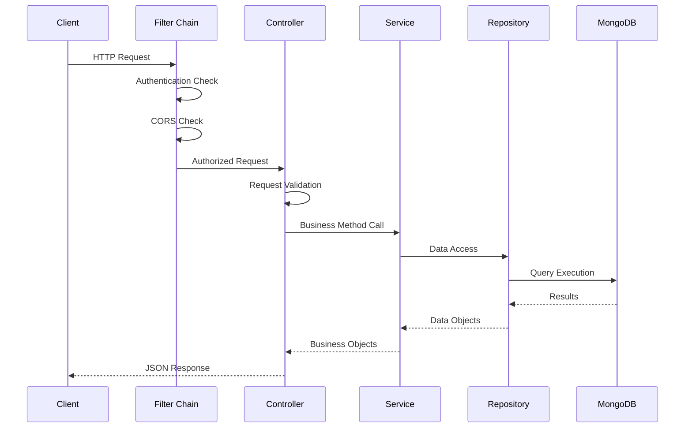

### WebSocket Communication

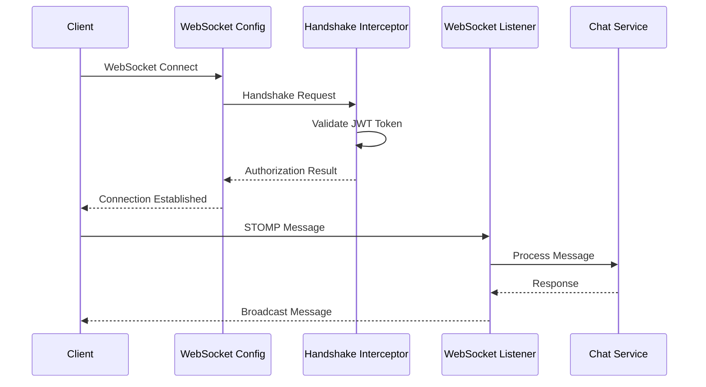

### Kafka Async Processing

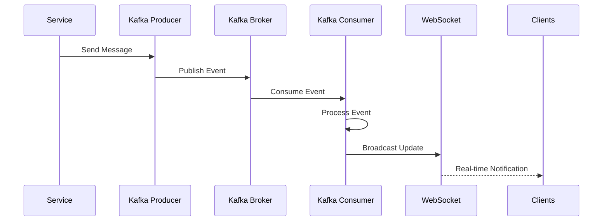

## Data Flow

### Video Upload Flow

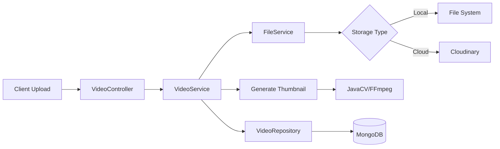

### Feed Generation Flow

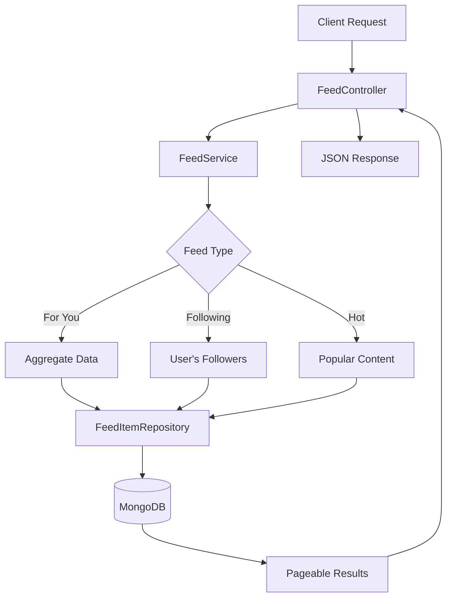

### Real-time Messaging Flow

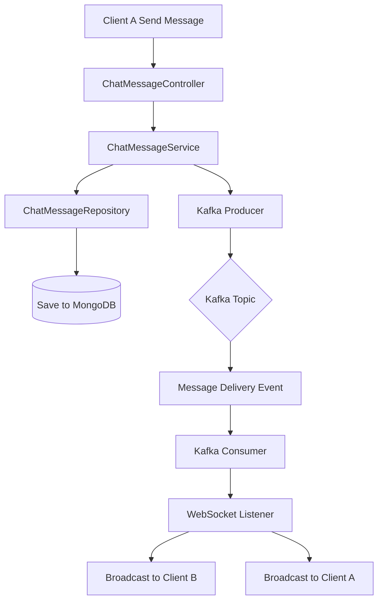

## Technology Choices

### Backend Framework: Spring Boot 3.3.5

**Rationale**:

- **Mature Ecosystem**: Extensive libraries and community support
- **Production Ready**: Battle-tested framework
- **Dependency Injection**: IoC container for loose coupling
- **Security**: Built-in Spring Security integration
- **Documentation**: OpenAPI/Swagger support

**Version**: 3.3.5 (Latest stable as of 2024)

### Database: MongoDB

**Rationale**:

- **Document Model**: Fits social media data structure (nested objects)
- **Flexible Schema**: Easy to evolve as requirements change
- **Horizontal Scaling**: Sharding support for growth
- **Performance**: Fast reads for feed generation
- **DBRef**: Maintains references between documents

**Collections**:

- users, user_details, roles, permissions
- videos, comments, feed_items
- chat_message, conversations
- file_documents

### Security: JWT + OAuth2 Resource Server

**Rationale**:

- **Stateless**: No server-side session management
- **Scalable**: Works across multiple instances
- **Industry Standard**: OAuth2 compliance
- **Custom Decoder**: Full control over token validation
- **Refresh Tokens**: Enhanced security

### Real-time: WebSocket + STOMP

**Rationale**:

- **Bidirectional**: Server can push updates
- **STOMP Protocol**: Standard messaging protocol
- **Scalable**: Can scale horizontally
- **Integration**: Works with Spring Messaging

### Async Processing: Apache Kafka

**Rationale**:

- **Decoupling**: Services don't block on processing
- **Reliability**: Message persistence and retry
- **Scalability**: Can handle high message volumes
- **Integration**: Spring Kafka simplifies implementation

### AI Integration: Spring AI

**Rationale**:

- **Abstraction**: Vendor-agnostic AI integration
- **OpenAI Support**: GPT model integration
- **Memory**: Conversation context management
- **Chat Support**: Built-in chat capabilities

## Scalability Considerations

### Current Architecture (Single Instance)

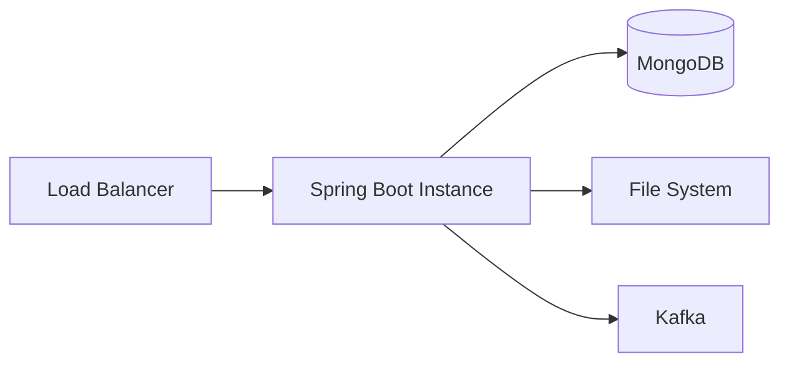

### Horizontal Scaling Strategy

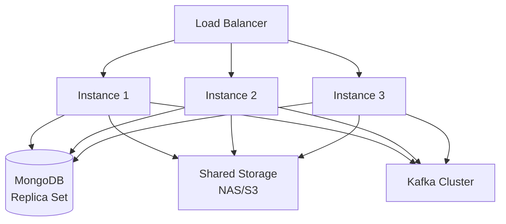

### Scalability Techniques

1. **Stateless Application**: JWT tokens enable multiple instances
2. **Database Sharding**: MongoDB sharding by user_id or video_id
3. **File Storage**: Migrate to S3/Cloudinary for CDN
4. **Caching**: Redis for frequently accessed data
5. **Read Replicas**: MongoDB replica sets for read scaling
6. **Async Processing**: Kafka for heavy operations

## Security Architecture

### Authentication Flow

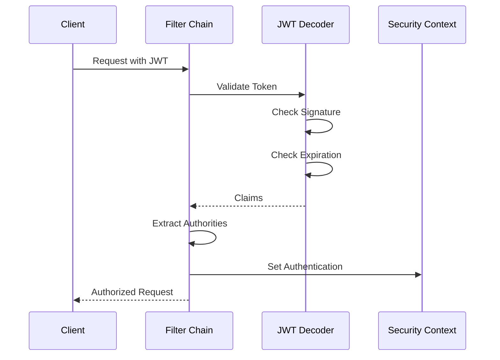

### Security Layers

1. **Transport Layer**: HTTPS for all communications
2. **Authentication**: JWT token validation
3. **Authorization**: Role-based access control (RBAC)
4. **CORS**: Configured for allowed origins
5. **Input Validation**: Jakarta Bean Validation
6. **Password Hashing**: BCrypt with strength 12
7. **Token Storage**: Secure storage on client (Expo SecureStore)
8. **File Upload**: Size limits (50MB), type validation

### Security Configuration

**Security Settings**:

- Public endpoints: `/auth/**`, `/files/**`, `/videos/**`
- Protected endpoints: Require authentication
- Admin endpoints: Require ADMIN role
- CORS: Configurable via `${CORS_URL}`
- CSRF: Disabled (using JWT instead)

## Related Documents

- [PROJECT_OVERVIEW.md](./PROJECT_OVERVIEW.md) - High-level project overview
- [DATABASE_SCHEMA.md](./DATABASE_SCHEMA.md) - Database design details
- [BACKEND_RULES.md](./BACKEND_RULES.md) - Backend development guidelines

## Change Log

| Version | Date       | Changes         | Author       |
| ------- | ---------- | --------------- | ------------ |
| 1.0     | 2025-01-27 | Initial version | Backend Team |
