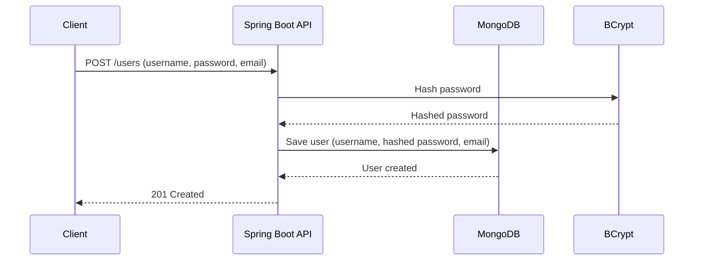
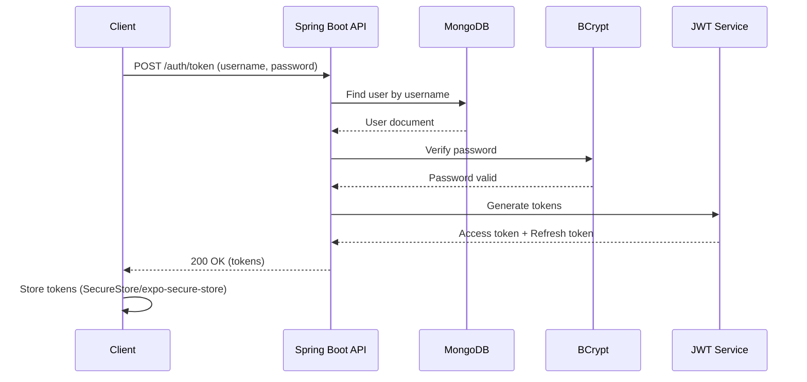
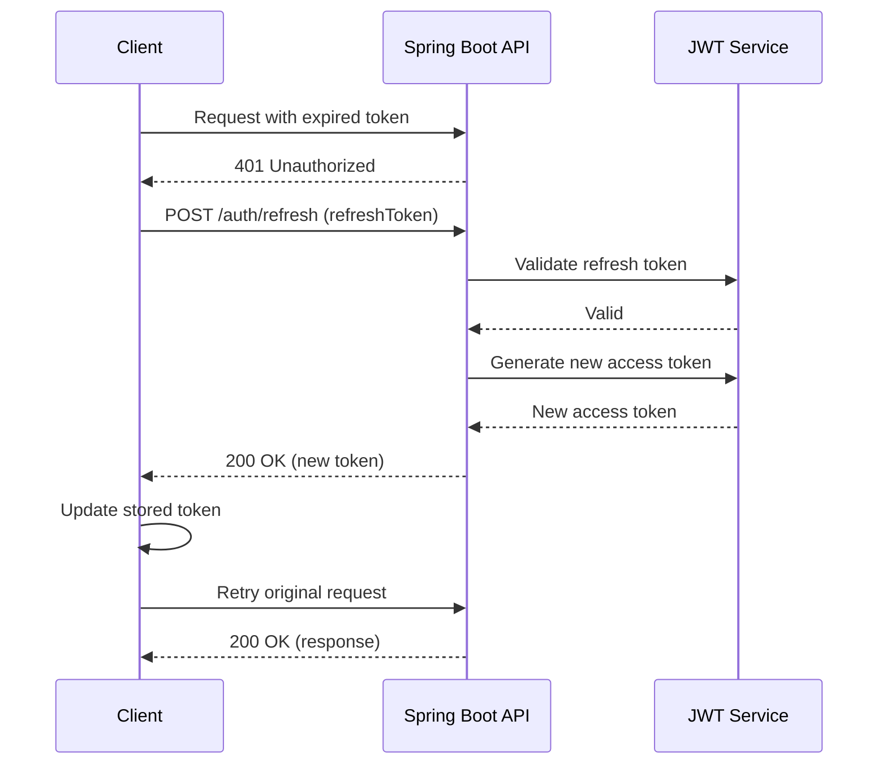
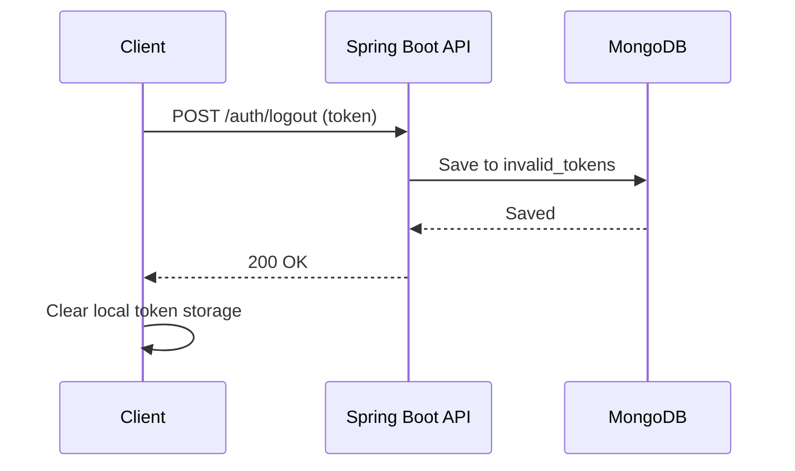

# Authentication Flow

> **Version**: 1.0
> **Last Updated**: 2025-01-27
> **Owner**: Backend Team

## Table of Contents

- [Overview](#overview)
- [Authentication Strategy](#authentication-strategy)
- [Registration Flow](#registration-flow)
- [Login Flow](#login-flow)
- [Token Management](#token-management)
- [Role-Based Access Control](#role-based-access-control)
- [Security Best Practices](#security-best-practices)

## Overview

The Social uses **JWT-based authentication** with OAuth2 Resource Server pattern. Authentication is stateless and scalable.

## Authentication Strategy

### JWT Token Structure

```json
{
  "sub": "507f1f77bcf86cd799439011",
  "iat": 1704067200,
  "exp": 1704070800,
  "jti": "token_id",
  "authorities": ["ROLE_USER", "ROLE_ADMIN"]
}
```

### Token Types

1. **Access Token**: Short-lived (default: 1 hour)
2. **Refresh Token**: Long-lived (default: 7 days)

## Registration Flow



**Implementation**:

1. Client sends registration request
2. Server validates input (username, password, email)
3. Password is hashed using BCrypt (strength 12)
4. User document is created in MongoDB
5. Response with created user ID

## Login Flow



**Implementation**:

**Request**:

```http
POST /api/v1/auth/token
Content-Type: application/json

{
  "username": "johndoe",
  "password": "password123"
}
```

**Response**:

```json
{
  "code": 1000,
  "message": "Successful",
  "result": {
    "token": "eyJhbGciOiJIUzI1NiIsInR5cCI6IkpXVCJ9...",
    "refreshToken": "refresh_token_here",
    "tokenType": "Bearer"
  }
}
```

**Client Storage** (Mobile):

```typescript
import * as SecureStore from "expo-secure-store";

// Store token
await SecureStore.setItemAsync("APP_TOKEN", token);

// Retrieve token
const token = await SecureStore.getItemAsync("APP_TOKEN");

// Delete token (logout)
await SecureStore.deleteItemAsync("APP_TOKEN");
```

## Token Management

### Token Refresh Flow



**Implementation**:

**Mobile Client** (HttpClient.ts):

```typescript
api.interceptors.response.use(
  (res) => res,
  async (error) => {
    const original = error.config;

    if (error.response?.status === 401 && !original._retry) {
      original._retry = true;

      try {
        // Refresh token
        const newToken = await refreshToken();
        setAuthToken(newToken);

        // Retry original request
        original.headers.Authorization = `Bearer ${newToken}`;
        return api(original);
      } catch (e) {
        // Refresh failed, logout user
        await logout();
        return Promise.reject(e);
      }
    }

    return Promise.reject(error);
  }
);
```

### Token Validation

**Backend** (CustomJwtDecoder.java):

```java
@Component
public class CustomJwtDecoder implements JwtDecoder {

    public Jwt decode(String token) throws JwtException {
        // Validate signature
        // Validate expiration
        // Check blacklist (invalid_tokens collection)
        // Extract authorities
        // Return JWT claims
    }
}
```

### Logout Flow



**Invalid Token Storage**:

```java
// Store in MongoDB for validation
db.invalid_tokens.insertOne({
  "token_id": "jti_from_jwt",
  "user_id": "user_id",
  "expire_at": "2025-01-28T00:00:00Z",
  "created_at": "2025-01-27T12:00:00Z"
});
```

## Role-Based Access Control

### Roles

1. **ADMIN**: Full system access
2. **USER**: Standard user access
3. **MODERATOR**: Content moderation access

### Permissions

| Permission     | Description              |
| -------------- | ------------------------ |
| `VIDEO:CREATE` | Create and upload videos |
| `VIDEO:DELETE` | Delete videos            |
| `USER:MANAGE`  | Manage users             |
| `ADMIN:ACCESS` | Access admin panel       |

### Enforcement

**Method-Level Security**:

```java
@PreAuthorize("hasRole('ADMIN')")
public void deleteVideo(String id) {
    // Only ADMIN can delete
}
```

**Endpoint-Level Security**:

```java
// SecuritySetting.java
static String[] ADMIN_ENDPOINTS = {
    "/admin/**"
};

.requestMatchers(ADMIN_ENDPOINTS).hasRole("ADMIN")
```

## Security Best Practices

### Password Security

```java
@Bean
PasswordEncoder passwordEncoder() {
    return new BCryptPasswordEncoder(12); // High cost factor
}
```

### Token Security

1. **Short Expiration**: Access tokens expire in 1 hour
2. **Refresh Tokens**: Long-lived for seamless UX
3. **Token Blacklist**: Invalidated tokens stored in MongoDB
4. **Secure Storage**: Client uses SecureStore (mobile)

### CORS Configuration

```java
@Bean
CorsConfigurationSource corsConfigurationSource() {
    CorsConfiguration configuration = new CorsConfiguration();
    configuration.addAllowedOriginPattern("**");
    configuration.addAllowedMethod("*");
    configuration.addAllowedHeader("*");
    return source;
}
```

### HTTPS Enforcement

All production APIs must use HTTPS. Tokens must never be sent over HTTP.

## Related Documents

- [BACKEND_RULES.md](./BACKEND_RULES.md) - Backend implementation
- [API_DOCUMENTATION.md](./API_DOCUMENTATION.md) - Authentication endpoints

## Change Log

| Version | Date       | Changes         | Author       |
| ------- | ---------- | --------------- | ------------ |
| 1.0     | 2025-01-27 | Initial version | Backend Team |
