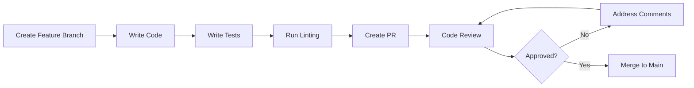

# Code Review Guidelines

> **Version**: 1.0
> **Last Updated**: 2025-01-27
> **Owner**: Development Team

## Table of Contents

- [Review Process](#review-process)
- [Code Review Checklist](#code-review-checklist)
- [Common Pitfalls](#common-pitfalls)
- [Performance Considerations](#performance-considerations)
- [Security Review Points](#security-review-points)
- [Documentation Requirements](#documentation-requirements)

## Review Process

### Pull Request Workflow



### Review Timeline

- **Minor Changes**: < 100 lines → 1 reviewer, 24-hour timeline
- **Standard Changes**: 100-500 lines → 2 reviewers, 48-hour timeline
- **Major Changes**: > 500 lines → 3 reviewers, 72-hour timeline

## Code Review Checklist

### Backend Review Checklist

- [ ] **Architecture**: Follows layered architecture pattern
- [ ] **Naming**: Consistent with project conventions
- [ ] **Error Handling**: Uses `AppException` and `ErrorCode`
- [ ] **Validation**: Request validation with `@Valid`
- [ ] **Security**: Authentication and authorization enforced
- [ ] **Logging**: Appropriate log levels (INFO, WARN, ERROR)
- [ ] **Testing**: Unit tests or integration tests added
- [ ] **Documentation**: Javadoc for public methods
- [ ] **Database**: Efficient queries, proper indexing
- [ ] **Transactions**: Proper `@Transactional` usage

### Frontend Review Checklist

- [ ] **Components**: Reusable and well-structured
- [ ] **State Management**: Appropriate use of Context/Redux/Zustand
- [ ] **API Integration**: Error handling implemented
- [ ] **Styling**: Consistent with design system
- [ ] **Performance**: Optimized rendering (memoization)
- [ ] **Accessibility**: Proper ARIA labels
- [ ] **TypeScript**: Types defined for all props and functions
- [ ] **Navigation**: Proper navigation patterns
- [ ] **Loading States**: Loading and error states handled
- [ ] **Testing**: Component tests added

## Common Pitfalls

### Backend Pitfalls

**1. Missing Error Handling**:

```java
// ❌ Bad
public Video getVideo(String id) {
    return videoRepository.findById(id).get();
}

// ✅ Good
public Video getVideo(String id) {
    return videoRepository.findById(id)
            .orElseThrow(() -> new AppException(ErrorCode.VIDEO_NOT_FOUND));
}
```

**2. N+1 Query Problem**:

```java
// ❌ Bad - N+1 queries
for (User user : users) {
    List<Video> videos = videoRepository.findByUploader(user);
}

// ✅ Good - Single query with JOIN
@Query("{ 'uploader_ref': { $in: ?0 } }")
List<Video> findByUploaders(List<UserDetail> uploaders);
```

**3. Missing Validation**:

```java
// ❌ Bad
@PostMapping
public ResponseEntity<Void> createUser(@RequestBody UserRequest request) {
    // No validation
}

// ✅ Good
@PostMapping
public ResponseEntity<Void> createUser(
        @Valid @RequestBody UserRequest request) {
    // Validated automatically
}
```

### Frontend Pitfalls

**1. Missing Loading States**:

```typescript
// ❌ Bad
const { data } = useQuery(['users'], fetchUsers);
return <div>{data.map(...)}</div>;

// ✅ Good
const { data, isLoading } = useQuery(['users'], fetchUsers);
if (isLoading) return <LoadingSpinner />;
return <div>{data.map(...)}</div>;
```

**2. Missing Error Boundaries**:

```typescript
// ❌ Bad
function App() {
  return <ComponentThatMayCrash />;
}

// ✅ Good
function App() {
  return (
    <ErrorBoundary>
      <ComponentThatMayCrash />
    </ErrorBoundary>
  );
}
```

**3. Inefficient Re-renders**:

```typescript
// ❌ Bad - Re-renders on every parent update
const Component = ({ data }) => {
  const processedData = expensiveProcess(data);
  return <div>{processedData}</div>;
};

// ✅ Good - Memoized
const Component = ({ data }) => {
  const processedData = useMemo(() => expensiveProcess(data), [data]);
  return <div>{processedData}</div>;
};
```

## Performance Considerations

### Backend Performance

**1. Database Indexing**:

```java
// ✅ Good - Indexed field
@Indexed(unique = true)
@Field("username")
String username;
```

**2. Pagination**:

```java
// ✅ Good - Paginated results
public Page<Video> getAllVideos(Pageable pageable) {
    return videoRepository.findAll(pageable);
}
```

**3. Lazy Loading vs Eager Loading**:

```java
// ✅ Lazy loading for large collections
@DBRef(lazy = true)
Set<Video> videos;
```

### Frontend Performance

**1. List Optimization**:

```typescript
// ✅ FlatList for performance
<FlatList
  data={items}
  renderItem={renderItem}
  keyExtractor={keyExtractor}
  windowSize={10}
  initialNumToRender={10}
/>
```

**2. Image Optimization**:

```typescript
// ✅ Optimized image loading
<Image source={{ uri }} cachePolicy="memory-disk" contentFit="cover" />
```

## Security Review Points

### Authentication and Authorization

- [ ] **JWT Validation**: Valid token required for protected endpoints
- [ ] **Role Checks**: Admin endpoints use `@PreAuthorize("hasRole('ADMIN')")`
- [ ] **Password Security**: BCrypt hashing with strength 12
- [ ] **Token Storage**: Secure storage on client (SecureStore)

### Input Validation

- [ ] **Request Validation**: `@Valid` on all request bodies
- [ ] **File Upload**: File type and size validation
- [ ] **SQL Injection**: MongoDB queries use parameterized queries
- [ ] **XSS Prevention**: Sanitize user input before display

### Data Protection

- [ ] **Sensitive Data**: PII not logged in production
- [ ] **HTTPS**: All API calls use HTTPS
- [ ] **CORS**: Proper CORS configuration
- [ ] **Rate Limiting**: Consider rate limiting for public endpoints

## Documentation Requirements

### Code Documentation

**Backend** (Java):

```java
/**
 * Uploads a video to the server.
 *
 * @param request Video upload request containing file and metadata
 * @return Video upload response with video ID and URL
 * @throws AppException if file is invalid or upload fails
 */
public VideoUploadResponse uploadVideo(VideoUploadRequest request);
```

**Frontend** (TypeScript):

```typescript
/**
 * Login service method to authenticate user.
 *
 * @param credentials - User credentials (username, password)
 * @returns Promise with authentication tokens
 * @throws Error if authentication fails
 */
export const loginRequest = async (credentials: LoginPayload) => {
  // Implementation
};
```

### README Updates

When adding new features, update:

- [ ] API documentation
- [ ] Architecture diagrams (if applicable)
- [ ] Setup instructions
- [ ] Environment variables
- [ ] Deployment notes

## Review Approval

### Required Approvals

- **Minor Changes**: 1 approval required
- **Standard Changes**: 2 approvals required
- **Major Changes**: 3 approvals + Tech Lead approval

### Automatic Merge Rules

Auto-merge allowed if:

- All checks pass (CI/CD)
- Code coverage > 80%
- No security vulnerabilities
- Approved by required reviewers

## Post-Merge

After merge, verify:

- [ ] Changes deployed to staging
- [ ] Smoke tests pass
- [ ] No regression in existing functionality

## Related Documents

- [BACKEND_RULES.md](./BACKEND_RULES.md) - Coding standards
- [ERROR_HANDLING.md](./ERROR_HANDLING.md) - Error handling patterns

## Change Log

| Version | Date       | Changes         | Author           |
| ------- | ---------- | --------------- | ---------------- |
| 1.0     | 2025-01-27 | Initial version | Development Team |
