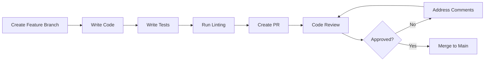

# Code Review Guidelines

> **Version**: 1.0
> **Last Updated**: 2025-01-27
> **Owner**: Development Team

## Table of Contents

- [Review Process](#review-process)
- [Code Review Checklist](#code-review-checklist)
- [Common Pitfalls](#common-pitfalls)
- [Performance Considerations](#performance-considerations)
- [Security Review Points](#security-review-points)
- [Documentation Requirements](#documentation-requirements)

## Review Process

### Pull Request Workflow


```mermaid
graph LR
    A[Create Feature Branch] --> B[Write Code]
    B --> C[Write Tests]
    C --> D[Run Linting]
    D --> E[Create PR]
    E --> F[Code Review]
    F --> G{Approved?}
    G -->|No| H[Address Comments]
    H --> F
    G -->|Yes| I[Merge to Main]
```

### Review Timeline

- **Minor Changes**: < 100 lines → 1 reviewer, 24-hour timeline
- **Standard Changes**: 100-500 lines → 2 reviewers, 48-hour timeline
- **Major Changes**: > 500 lines → 3 reviewers, 72-hour timeline

## Code Review Checklist

### Backend Review Checklist

- [ ] **Architecture**: Follows layered architecture pattern
- [ ] **Naming**: Consistent with project conventions
- [ ] **Error Handling**: Uses `AppException` and `ErrorCode`
- [ ] **Validation**: Request validation with `@Valid`
- [ ] **Security**: Authentication and authorization enforced
- [ ] **Logging**: Appropriate log levels (INFO, WARN, ERROR)
- [ ] **Testing**: Unit tests or integration tests added
- [ ] **Documentation**: Javadoc for public methods
- [ ] **Database**: Efficient queries, proper indexing
- [ ] **Transactions**: Proper `@Transactional` usage

### Frontend Review Checklist

- [ ] **Components**: Reusable and well-structured
- [ ] **State Management**: Appropriate use of Context/Redux/Zustand
- [ ] **API Integration**: Error handling implemented
- [ ] **Styling**: Consistent with design system
- [ ] **Performance**: Optimized rendering (memoization)
- [ ] **Accessibility**: Proper ARIA labels
- [ ] **TypeScript**: Types defined for all props and functions
- [ ] **Navigation**: Proper navigation patterns
- [ ] **Loading States**: Loading and error states handled
- [ ] **Testing**: Component tests added

## Common Pitfalls

### Backend Pitfalls

**1. Missing Error Handling**:

```java
// ❌ Bad
public Video getVideo(String id) {
    return videoRepository.findById(id).get();
}

// ✅ Good
public Video getVideo(String id) {
    return videoRepository.findById(id)
            .orElseThrow(() -> new AppException(ErrorCode.VIDEO_NOT_FOUND));
}
```

**2. N+1 Query Problem**:

```java
// ❌ Bad - N+1 queries
for (User user : users) {
    List<Video> videos = videoRepository.findByUploader(user);
}

// ✅ Good - Single query with JOIN
@Query("{ 'uploader_ref': { $in: ?0 } }")
List<Video> findByUploaders(List<UserDetail> uploaders);
```

**3. Missing Validation**:

```java
// ❌ Bad
@PostMapping
public ResponseEntity<Void> createUser(@RequestBody UserRequest request) {
    // No validation
}

// ✅ Good
@PostMapping
public ResponseEntity<Void> createUser(
        @Valid @RequestBody UserRequest request) {
    // Validated automatically
}
```

### Frontend Pitfalls

**1. Missing Loading States**:

```typescript
// ❌ Bad
const { data } = useQuery(['users'], fetchUsers);
return <div>{data.map(...)}</div>;

// ✅ Good
const { data, isLoading } = useQuery(['users'], fetchUsers);
if (isLoading) return <LoadingSpinner />;
return <div>{data.map(...)}</div>;
```

**2. Missing Error Boundaries**:

```typescript
// ❌ Bad
function App() {
  return <ComponentThatMayCrash />;
}

// ✅ Good
function App() {
  return (
    <ErrorBoundary>
      <ComponentThatMayCrash />
    </ErrorBoundary>
  );
}
```

**3. Inefficient Re-renders**:

```typescript
// ❌ Bad - Re-renders on every parent update
const Component = ({ data }) => {
  const processedData = expensiveProcess(data);
  return <div>{processedData}</div>;
};

// ✅ Good - Memoized
const Component = ({ data }) => {
  const processedData = useMemo(() => expensiveProcess(data), [data]);
  return <div>{processedData}</div>;
};
```

## Performance Considerations

### Backend Performance

**1. Database Indexing**:

```java
// ✅ Good - Indexed field
@Indexed(unique = true)
@Field("username")
String username;
```

**2. Pagination**:

```java
// ✅ Good - Paginated results
public Page<Video> getAllVideos(Pageable pageable) {
    return videoRepository.findAll(pageable);
}
```

**3. Lazy Loading vs Eager Loading**:

```java
// ✅ Lazy loading for large collections
@DBRef(lazy = true)
Set<Video> videos;
```

### Frontend Performance

**1. List Optimization**:

```typescript
// ✅ FlatList for performance
<FlatList
  data={items}
  renderItem={renderItem}
  keyExtractor={keyExtractor}
  windowSize={10}
  initialNumToRender={10}
/>
```

**2. Image Optimization**:

```typescript
// ✅ Optimized image loading
<Image source={{ uri }} cachePolicy="memory-disk" contentFit="cover" />
```

## Security Review Points

### Authentication and Authorization

- [ ] **JWT Validation**: Valid token required for protected endpoints
- [ ] **Role Checks**: Admin endpoints use `@PreAuthorize("hasRole('ADMIN')")`
- [ ] **Password Security**: BCrypt hashing with strength 12
- [ ] **Token Storage**: Secure storage on client (SecureStore)

### Input Validation

- [ ] **Request Validation**: `@Valid` on all request bodies
- [ ] **File Upload**: File type and size validation
- [ ] **SQL Injection**: MongoDB queries use parameterized queries
- [ ] **XSS Prevention**: Sanitize user input before display

### Data Protection

- [ ] **Sensitive Data**: PII not logged in production
- [ ] **HTTPS**: All API calls use HTTPS
- [ ] **CORS**: Proper CORS configuration
- [ ] **Rate Limiting**: Consider rate limiting for public endpoints

## Documentation Requirements

### Code Documentation

**Backend** (Java):

```java
/**
 * Uploads a video to the server.
 *
 * @param request Video upload request containing file and metadata
 * @return Video upload response with video ID and URL
 * @throws AppException if file is invalid or upload fails
 */
public VideoUploadResponse uploadVideo(VideoUploadRequest request);
```

**Frontend** (TypeScript):

```typescript
/**
 * Login service method to authenticate user.
 *
 * @param credentials - User credentials (username, password)
 * @returns Promise with authentication tokens
 * @throws Error if authentication fails
 */
export const loginRequest = async (credentials: LoginPayload) => {
  // Implementation
};
```

### README Updates

When adding new features, update:

- [ ] API documentation
- [ ] Architecture diagrams (if applicable)
- [ ] Setup instructions
- [ ] Environment variables
- [ ] Deployment notes

## Review Approval

### Required Approvals

- **Minor Changes**: 1 approval required
- **Standard Changes**: 2 approvals required
- **Major Changes**: 3 approvals + Tech Lead approval

### Automatic Merge Rules

Auto-merge allowed if:

- All checks pass (CI/CD)
- Code coverage > 80%
- No security vulnerabilities
- Approved by required reviewers

## Post-Merge

After merge, verify:

- [ ] Changes deployed to staging
- [ ] Smoke tests pass
- [ ] No regression in existing functionality

## Related Documents

- [BACKEND_RULES.md](./BACKEND_RULES.md) - Coding standards
- [ERROR_HANDLING.md](./ERROR_HANDLING.md) - Error handling patterns

## Code Quality Patterns to Review

### Mobile App Specific Checks

**Service Layer Usage:**

- [ ] All API calls go through service files
- [ ] Services return `ApiResponse<T>` type
- [ ] No UI logic in services (no Alert, no navigation)
- [ ] Services use centralized `api` instance from HttpClient

**Context Provider Checks:**

- [ ] Context values are memoized with `useMemo`
- [ ] Default values provided in context creation
- [ ] State is cleared on logout/unmount
- [ ] Loading states included in context when appropriate

**Component State Management:**

- [ ] Loading flags prevent duplicate API calls
- [ ] Proper dependency arrays in `useEffect`
- [ ] Effects are cleaned up (subscriptions, timers)
- [ ] State updates use functional form when needed

**Error Handling:**

- [ ] All async operations have try-catch
- [ ] User-friendly error messages displayed
- [ ] Error states shown in UI with retry options
- [ ] Errors logged to console for debugging

**Navigation:**

- [ ] Navigation is typed correctly
- [ ] Route params accessed safely with type assertions
- [ ] Parent navigation accessed correctly when needed

**Image/URL Handling:**

- [ ] Utility functions used for URL construction
- [ ] Null/undefined URLs handled properly
- [ ] No hardcoded URLs or IP addresses

**Type Safety:**

- [ ] No `any` types used
- [ ] Proper TypeScript types from `Types/` directory
- [ ] Helper types created when needed

### Backend Specific Checks

**Service Layer:**

- [ ] Services implement interfaces
- [ ] Constructor injection used (not field injection)
- [ ] Optional handled properly (orElseThrow, not get())
- [ ] Business logic in services, not controllers

**Transaction Management:**

- [ ] `@Transactional` used for multi-step operations
- [ ] `readOnly = true` for query methods
- [ ] Proper transaction propagation when needed

**Error Handling:**

- [ ] `AppException` with `ErrorCode` used
- [ ] Errors logged with context
- [ ] No generic RuntimeException thrown
- [ ] Global exception handler catches all exceptions

**Validation:**

- [ ] `@Valid` annotation on request parameters
- [ ] Custom validators for complex validation
- [ ] Entity validation annotations used

**Repository:**

- [ ] Query methods used instead of manual filtering
- [ ] Custom queries use `@Query` annotation
- [ ] No N+1 query problems
- [ ] Proper indexing on frequently queried fields

**DTOs and Mappers:**

- [ ] DTOs used for API communication
- [ ] Entities not exposed directly
- [ ] MapStruct used for mapping
- [ ] Request/Response DTOs separated

**Response Wrapping:**

- [ ] All responses wrapped in `ApiResponse<T>`
- [ ] Proper HTTP status codes
- [ ] Consistent response format

### Common Code Smells to Flag

**Mobile App:**

1. Direct API calls in components
2. Missing loading states
3. Missing error handling
4. Hardcoded URLs
5. Unmemoized context values
6. Missing cleanup in effects
7. Direct state mutation
8. Missing current user filtering
9. Using `any` type
10. Missing empty states

**Backend:**

1. Field injection instead of constructor
2. Missing `@Transactional` on multi-step operations
3. Using `.get()` on Optional
4. Exposing entities directly
5. Missing `@Valid` on requests
6. N+1 query problems
7. Logging sensitive data
8. Catching and swallowing exceptions
9. Generic exceptions instead of AppException
10. Missing response wrapping

## Review Examples

### Good Code Examples

**Mobile - Service Pattern:**

```typescript
// ✅ Good - Service layer pattern
const ConversationService = {
  getMyConversations: async (
    params?: PaginationParams
  ): Promise<ApiResponse<Page<ConversationResponse>>> => {
    const queryParams = new URLSearchParams();
    if (params?.page !== undefined)
      queryParams.append("page", params.page.toString());
    const url = `/conversations/me${
      queryParams.toString() ? `?${queryParams.toString()}` : ""
    }`;
    const response = await api.get(url);
    return response.data;
  },
};
```

**Backend - Service Pattern:**

```java
// ✅ Good - Service with proper error handling
@Service
@RequiredArgsConstructor
@Slf4j
public class VideoServiceImpl implements VideoService {
    private final VideoRepository videoRepository;

    @Override
    @Transactional(readOnly = true)
    public VideoResponse getVideoById(String id) {
        log.debug("Getting video by id: {}", id);
        Video video = videoRepository.findById(id)
                .orElseThrow(() -> new AppException(ErrorCode.VIDEO_NOT_FOUND));
        return videoMapper.toResponse(video);
    }
}
```

### Bad Code Examples to Flag

**Mobile - Direct API Call:**

```typescript
// ❌ Bad - Direct API call in component
const handleCreate = async () => {
  const response = await api.post("/conversations", request);
  // Should use ConversationService
};
```

**Backend - Field Injection:**

```java
// ❌ Bad - Field injection
@Service
public class VideoServiceImpl {
    @Autowired
    private VideoRepository videoRepository; // Should use constructor injection
}
```

## Change Log

| Version | Date       | Changes                                         | Author           |
| ------- | ---------- | ----------------------------------------------- | ---------------- |
| 1.0     | 2025-01-27 | Initial version                                 | Development Team |
| 1.1     | 2025-01-27 | Added code quality patterns and review examples | Development Team |
