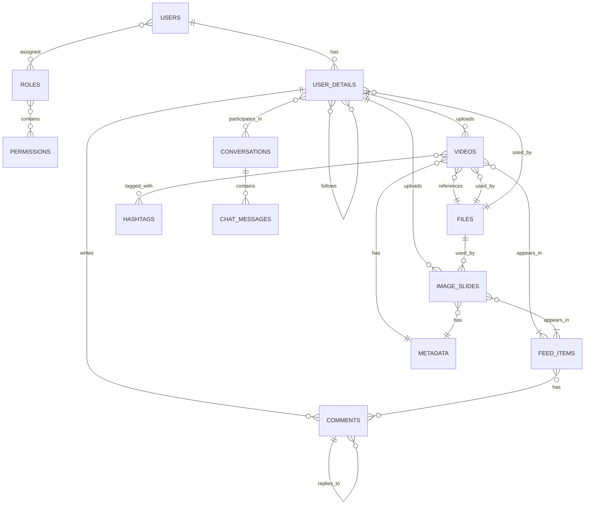

# Database Schema Documentation

> **Version**: 1.0
> **Last Updated**: 2025-01-27
> **Owner**: Backend Team

## Table of Contents

- [Database Overview](#database-overview)
- [Collections](#collections)
- [Relationships](#relationships)
- [Indexing Strategy](#indexing-strategy)
- [Data Validation](#data-validation)
- [Migration Strategy](#migration-strategy)
- [Performance Optimization](#performance-optimization)

## Database Overview

**Database Type**: MongoDB (Document-based NoSQL)

**Rationale**:

- Flexible schema for evolving social media requirements
- Rich document model with nested objects
- DBRef for managing relationships
- Horizontal scaling capability
- Fast read performance for feed generation

**Connection Configuration**:

```yaml
spring:
  data:
    mongodb:
      uri: ${MONGODB_URL}
      auto-index-creation: true
```

## Collections

### 1. users

**Description**: Core user authentication and authorization data

| Field        | Type      | Constraints      | Description            |
| ------------ | --------- | ---------------- | ---------------------- |
| `_id`        | String    | Primary Key      | MongoDB ObjectId       |
| `password`   | String    | Required         | BCrypt hashed password |
| `username`   | String    | Unique, Required | User login name        |
| `mail`       | String    | Unique, Sparse   | Email address          |
| `enable`     | Boolean   | Default: true    | Account enabled status |
| `roles_ref`  | Set<Role> | DBRef            | User roles             |
| `created_at` | Instant   | Auto             | Creation timestamp     |
| `created_by` | String    | Auto             | Creator ID             |
| `updated_at` | Instant   | Auto             | Last modification      |
| `updated_by` | String    | Auto             | Last modifier ID       |

**Indexes**:

- `username`: Unique index
- `mail`: Unique, sparse index

**Example**:

```json
{
  "_id": "507f1f77bcf86cd799439011",
  "username": "johndoe",
  "mail": "john@example.com",
  "password": "$2a$12$...",
  "enable": true,
  "roles_ref": [],
  "created_at": "2024-01-01T00:00:00Z"
}
```

### 2. user_details

**Description**: Extended user profile information

| Field             | Type            | Constraints     | Description                   |
| ----------------- | --------------- | --------------- | ----------------------------- |
| `_id`             | String          | Primary Key     | MongoDB ObjectId              |
| `user_ref`        | User            | DBRef, Required | Reference to users collection |
| `avatar_ref`      | FileDocument    | DBRef           | Profile picture reference     |
| `display_name`    | String          |                 | Display name                  |
| `bio`             | String          |                 | User biography                |
| `shown_name`      | String          |                 | Name to display               |
| `following_ref`   | Set<UserDetail> | DBRef           | Users being followed          |
| `following_count` | Integer         | Default: 0      | Number of followings          |
| `follower_ref`    | Set<UserDetail> | DBRef           | Users following this user     |
| `follower_count`  | Integer         | Default: 0      | Number of followers           |
| `created_at`      | Instant         | Auto            | Creation timestamp            |
| `updated_at`      | Instant         | Auto            | Last modification             |

**Relationships**:

- One `user_details` document references one `users` document
- Many-to-many relationship with other `user_details` (following/follower)

**Example**:

```json
{
  "_id": "507f1f77bcf86cd799439012",
  "user_ref": "507f1f77bcf86cd799439011",
  "display_name": "John Doe",
  "bio": "Creator & Developer",
  "following_count": 100,
  "follower_count": 500
}
```

### 3. roles

**Description**: Role definitions for RBAC

| Field             | Type            | Constraints | Description                     |
| ----------------- | --------------- | ----------- | ------------------------------- |
| `_id`             | String          | Primary Key | MongoDB ObjectId                |
| `role_name`       | String          | Required    | Role identifier (e.g., "ADMIN") |
| `description`     | String          |             | Role description                |
| `permissions_ref` | Set<Permission> | DBRef       | Assigned permissions            |
| `created_at`      | Instant         | Auto        | Creation timestamp              |

**Predefined Roles**:

- `ADMIN`: Full system access
- `USER`: Standard user access
- `MODERATOR`: Content moderation access

**Example**:

```json
{
  "_id": "507f1f77bcf86cd799439013",
  "role_name": "ADMIN",
  "description": "Administrator role with full access",
  "permissions_ref": []
}
```

### 4. permissions

**Description**: Permission definitions for fine-grained access control

| Field         | Type    | Constraints | Description            |
| ------------- | ------- | ----------- | ---------------------- |
| `_id`         | String  | Primary Key | MongoDB ObjectId       |
| `permission`  | String  | Required    | Permission identifier  |
| `description` | String  |             | Permission description |
| `created_at`  | Instant | Auto        | Creation timestamp     |

**Example**:

```json
{
  "_id": "507f1f77bcf86cd799439014",
  "permission": "VIDEO:CREATE",
  "description": "Create and upload videos"
}
```

### 5. videos

**Description**: Video content and metadata

| Field          | Type          | Constraints     | Description               |
| -------------- | ------------- | --------------- | ------------------------- |
| `_id`          | String        | Primary Key     | MongoDB ObjectId          |
| `uploader_ref` | UserDetail    | DBRef, Required | Video uploader            |
| `file_ref`     | FileDocument  | DBRef, Required | Video file reference      |
| `thumb_url`    | FileDocument  | DBRef           | Thumbnail reference       |
| `duration`     | Double        |                 | Video duration in seconds |
| `title`        | String        |                 | Video title               |
| `description`  | String        |                 | Video description         |
| `hashtags_ref` | List<HashTag> | DBRef           | Associated hashtags       |
| `metadata_ref` | MetaData      | DBRef           | Engagement metrics        |
| `created_at`   | Instant       | Auto            | Creation timestamp        |

**Example**:

```json
{
  "_id": "507f1f77bcf86cd799439015",
  "uploader_ref": "507f1f77bcf86cd799439012",
  "title": "My First Video",
  "duration": 30.5,
  "hashtags_ref": []
}
```

### 6. files

**Description**: File storage metadata (videos, images, documents)

| Field           | Type    | Constraints | Description                  |
| --------------- | ------- | ----------- | ---------------------------- |
| `_id`           | String  | Primary Key | MongoDB ObjectId             |
| `file_name`     | String  | Required    | Original filename            |
| `size`          | Long    |             | File size in bytes           |
| `public_id`     | String  |             | Cloudinary public ID         |
| `url`           | String  |             | File URL                     |
| `secure_url`    | String  |             | HTTPS file URL               |
| `format`        | String  |             | File format (mp4, jpg, etc.) |
| `resource_type` | String  |             | File type (video, image)     |
| `width`         | Integer |             | Image/video width            |
| `height`        | Integer |             | Image/video height           |
| `etag`          | String  |             | ETag for cache validation    |

**Storage Location**:

- Local: `/uploads/{user_id}/`
- Cloud: Cloudinary CDN

**Example**:

```json
{
  "_id": "507f1f77bcf86cd799439016",
  "file_name": "video.mp4",
  "size": 10485760,
  "url": "https://cloudinary.com/...",
  "format": "mp4",
  "resource_type": "video"
}
```

### 7. feed_items

**Description**: Aggregated feed content (videos, image slides)

| Field             | Type         | Constraints | Description               |
| ----------------- | ------------ | ----------- | ------------------------- |
| `_id`             | String       | Primary Key | MongoDB ObjectId          |
| `feed_item_type`  | Enum         | Required    | Type (VIDEO, IMAGE_SLIDE) |
| `video_ref`       | Video        | DBRef       | Video reference           |
| `image_slide_ref` | ImageSlide   | DBRef       | Image slide reference     |
| `hashtags_ref`    | Set<HashTag> | DBRef       | Hashtags                  |
| `comments_ref`    | Set<Comment> | DBRef       | Comments                  |
| `like_count`      | Long         | Default: 0  | Like count                |
| `comment_count`   | Long         | Default: 0  | Comment count             |
| `share_count`     | Long         | Default: 0  | Share count               |
| `created_at`      | Instant      | Auto        | Creation timestamp        |

**FeedItemType Enum**:

- `VIDEO`: Single video
- `IMAGE_SLIDE`: Multiple images

**Example**:

```json
{
  "_id": "507f1f77bcf86cd799439017",
  "feed_item_type": "VIDEO",
  "video_ref": "507f1f77bcf86cd799439015",
  "like_count": 1000,
  "comment_count": 50
}
```

### 8. comments

**Description**: Comment data with hierarchical replies

| Field            | Type         | Constraints | Description          |
| ---------------- | ------------ | ----------- | -------------------- |
| `_id`            | String       | Primary Key | MongoDB ObjectId     |
| `content`        | String       | Required    | Comment text         |
| `like_count`     | Long         | Default: 0  | Like count           |
| `dislike_count`  | Long         | Default: 0  | Dislike count        |
| `reply_count`    | Integer      | Default: 0  | Reply count          |
| `user_detail_id` | String       | Required    | Commenter ID         |
| `avatar_url`     | String       |             | Commenter avatar URL |
| `replies_ref`    | Set<Comment> | DBRef       | Nested replies       |
| `created_at`     | Instant      | Auto        | Creation timestamp   |

**Hierarchical Structure**:
Comments can have unlimited depth of replies using `replies_ref`.

### 9. image_slides

**Description**: Multi-image posts (like Instagram carousel)

| Field          | Type               | Constraints     | Description              |
| -------------- | ------------------ | --------------- | ------------------------ |
| `_id`          | String             | Primary Key     | MongoDB ObjectId         |
| `uploader_ref` | UserDetail         | DBRef, Required | Uploader                 |
| `images_ref`   | List<FileDocument> | DBRef, Required | Image files              |
| `thumb_url`    | FileDocument       | DBRef           | First image as thumbnail |
| `captions`     | String             |                 | Image captions           |
| `hashtags_ref` | List<HashTag>      | DBRef           | Hashtags                 |
| `metadata_ref` | MetaData           | DBRef           | Engagement metrics       |
| `created_at`   | Instant            | Auto            | Creation timestamp       |

### 10. hashtags

**Description**: Hashtag tracking and analytics

| Field         | Type    | Constraints      | Description              |
| ------------- | ------- | ---------------- | ------------------------ |
| `_id`         | String  | Primary Key      | MongoDB ObjectId         |
| `name`        | String  | Required, Unique | Hashtag name (without #) |
| `view_count`  | Integer | Default: 0       | Total view count         |
| `video_count` | Integer | Default: 0       | Associated videos count  |
| `created_at`  | Instant | Auto             | Creation timestamp       |

### 11. metadata

**Description**: Engagement metrics for content

| Field              | Type   | Constraints | Description      |
| ------------------ | ------ | ----------- | ---------------- |
| `_id`              | String | Primary Key | MongoDB ObjectId |
| `loves_count`      | Long   | Default: 0  | Total likes      |
| `comments_count`   | Long   | Default: 0  | Total comments   |
| `favourites_count` | Long   | Default: 0  | Total favorites  |
| `views_count`      | Long   | Default: 0  | Total views      |
| `shares_count`     | Long   | Default: 0  | Total shares     |

### 12. chat_message

**Description**: Chat messages for direct messaging

| Field                  | Type         | Constraints    | Description                |
| ---------------------- | ------------ | -------------- | -------------------------- |
| `_id`                  | String       | Primary Key    | MongoDB ObjectId           |
| `conversation_id`      | String       | Required       | Conversation ID            |
| `sender_id`            | String       | Required       | Message sender ID          |
| `message`              | String       |                | Message text               |
| `created_at`           | Instant      | Auto           | Message timestamp          |
| `edited`               | Boolean      | Default: false | Edit status                |
| `role`                 | String       |                | Role (user, assistant)     |
| `content`              | String       |                | AI content                 |
| `file_document`        | FileDocument | DBRef          | File attachment            |
| `avatar`               | FileDocument | DBRef          | Sender avatar              |
| `read_participants_id` | List<String> |                | Users who read the message |

### 13. conversations

**Description**: Chat conversations (1-on-1 or group)

| Field               | Type            | Constraints     | Description             |
| ------------------- | --------------- | --------------- | ----------------------- |
| `_id`               | String          | Primary Key     | MongoDB ObjectId        |
| `participant_hash`  | String          | Unique          | Hash of participant IDs |
| `user_details_ref`  | Set<UserDetail> | DBRef, Required | Participants            |
| `avatar_ref`        | FileDocument    | DBRef           | Conversation avatar     |
| `creator_id`        | String          |                 | Creator user ID         |
| `conversation_name` | String          |                 | Group name              |
| `conversation_type` | Enum            | Required        | DIRECT or GROUP         |
| `created_at`        | Instant         | Auto            | Creation timestamp      |

**ConversationType Enum**:

- `DIRECT`: 1-on-1 chat
- `GROUP`: Multi-participant chat

### 14. invalid_tokens

**Description**: Blacklisted JWT tokens for logout

| Field        | Type    | Constraints | Description        |
| ------------ | ------- | ----------- | ------------------ |
| `_id`        | String  | Primary Key | MongoDB ObjectId   |
| `user_id`    | String  | Required    | User ID            |
| `token_id`   | String  | Required    | JWT JTI (token ID) |
| `expire_at`  | Date    | Required    | Token expiration   |
| `created_at` | Instant | Auto        | Creation timestamp |

**Use Case**: Store tokens marked as invalid during logout for validation

## Relationships

### Entity Relationship Diagram



### Relationship Types

#### One-to-One

- `users` ⟷ `user_details`: One user has one profile
- `videos` ⟷ `metadata`: One video has one metadata record

#### One-to-Many

- `users` ⟶ `videos`: One user can upload many videos
- `videos` ⟶ `comments`: One video can have many comments
- `conversations` ⟶ `chat_messages`: One conversation has many messages

#### Many-to-Many

- `users` ⟷ `users` (through `roles`): Users can have multiple roles
- `users` ⟷ `users` (through follow): Users can follow many users
- `videos` ⟷ `hashtags`: Videos can have multiple hashtags

#### Embedded (Nested)

- `comments` ⟷ `comments`: Nested replies within a comment
- `feed_items`: Aggregates videos and image slides

## Indexing Strategy

### Current Indexes

```java
// users collection
@Indexed(unique = true)
private String username; // Unique username index

@Indexed(unique = true, sparse = true)
private String mail; // Unique, sparse email index
```

### Recommended Indexes

```javascript
// users
db.users.createIndex({ username: 1 }, { unique: true });
db.users.createIndex({ mail: 1 }, { unique: true, sparse: true });

// user_details
db.user_details.createIndex({ user_ref: 1 });
db.user_details.createIndex({ display_name: "text" });

// videos
db.videos.createIndex({ uploader_ref: 1 });
db.videos.createIndex({ created_at: -1 });
db.videos.createIndex({ hashtags_ref: 1 });

// feed_items
db.feed_items.createIndex({ feed_item_type: 1, created_at: -1 });
db.feed_items.createIndex({ like_count: -1 });

// chat_message
db.chat_message.createIndex({ conversation_id: 1, created_at: -1 });
db.chat_message.createIndex({ sender_id: 1 });

// conversations
db.conversations.createIndex({ participant_hash: 1 }, { unique: true });
db.conversations.createIndex({ conversation_type: 1 });

// invalid_tokens
db.invalid_tokens.createIndex({ token_id: 1 }, { unique: true });
db.invalid_tokens.createIndex({ expire_at: 1 }, { expireAfterSeconds: 0 });
```

### Index Creation Strategy

**Automatic Creation**: `auto-index-creation: true` in config

**Best Practices**:

1. Index frequently queried fields
2. Use compound indexes for multi-field queries
3. Consider sparse indexes for optional fields
4. Use TTL index for `invalid_tokens`
5. Text indexes for search fields

## Data Validation

### MongoDB Level Validation

```javascript
// Example validation for users collection
db.createCollection("users", {
  validator: {
    $jsonSchema: {
      bsonType: "object",
      required: ["username", "password", "enable"],
      properties: {
        username: {
          bsonType: "string",
          description: "must be a string and is required",
        },
        mail: {
          bsonType: "string",
          pattern: "^[a-zA-Z0-9._%+-]+@[a-zA-Z0-9.-]+\\.[a-zA-Z]{2,}$",
          description: "must be a valid email",
        },
      },
    },
  },
});
```

### Application Level Validation

**Jakarta Bean Validation**:

```java
@Email
@Indexed(unique = true, sparse = true)
private String mail;

@Min(value = 0)
@Max(value = 1000)
private int followerCount;
```

## Migration Strategy

### Backup Strategy

**Automated Backups**:

```bash
# Daily backup script
mongodump --uri="mongodb://localhost:27017" \
  --out=/backups/$(date +%Y%m%d) \
  --gzip
```

**Restore**:

```bash
mongorestore --uri="mongodb://localhost:27017" \
  --archive=/backups/20240101.archive.gz \
  --gzip
```

### Schema Evolution

**Version Control**:

- Document schema versions in code comments
- Use `@Version` for optimistic locking
- Gradual migration scripts

**Adding Fields**:

- Use `@Field` with default values for backward compatibility
- Query with `exists: true` to check for field existence

**Removing Fields**:

- Deprecate field before removal
- Create migration script to update documents

## Performance Optimization

### Query Optimization

1. **Use Indexes**: Create indexes on frequently queried fields
2. **Limit Results**: Use pagination with `Pageable`
3. **Projection**: Fetch only required fields
4. **Aggregation Pipeline**: Use for complex queries

**Example**:

```java
// Efficient pagination
Page<Video> videos = videoRepository.findAll(PageRequest.of(page, size));

// Projection to reduce data transfer
@Query("{ 'uploader_ref': ?0 }, { 'id': 1, 'title': 1, 'file_ref': 1 }")
List<Video> findVideosByUploader(UserDetail uploader);
```

### Sharding Strategy

**Future Sharding** (for horizontal scaling):

```javascript
// Shard by user_id for users collection
sh.shardCollection("thesocial.users", { user_id: "hashed" });

// Shard by created_at for time-series data (videos, feed_items)
sh.shardCollection("thesocial.videos", { created_at: 1 });
```

### Connection Pooling

**Configuration**:

```yaml
spring:
  data:
    mongodb:
      options:
        max-pool-size: 50
        min-pool-size: 5
        max-idle-time-ms: 30000
```

## Related Documents

- [ARCHITECTURE.md](./ARCHITECTURE.md) - System architecture overview
- [BACKEND_RULES.md](./BACKEND_RULES.md) - Repository and service patterns

## Change Log

| Version | Date       | Changes         | Author       |
| ------- | ---------- | --------------- | ------------ |
| 1.0     | 2025-01-27 | Initial version | Backend Team |
