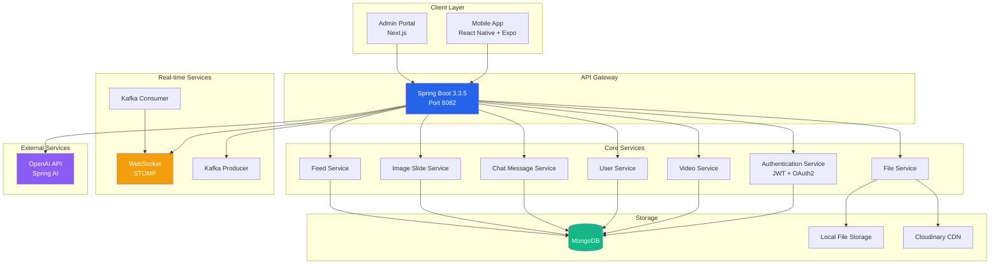
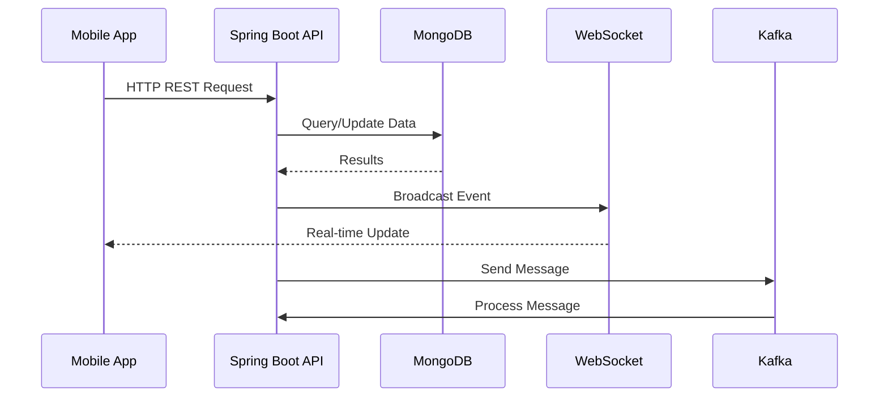

# Project Overview: TikTok Clone

> **Version**: 1.0
> **Last Updated**: 2025-01-27
> **Owner**: Development Team

## Table of Contents

- [Project Purpose](#project-purpose)
- [Tech Stack](#tech-stack)
- [System Architecture](#system-architecture)
- [Key Features](#key-features)
- [Development Team](#development-team)
- [Project Timeline](#project-timeline)

## Overview

This project is a full-stack TikTok-like social media application designed to enable users to create, share, and discover short-form video content. The system includes real-time messaging, feed generation, and administrative capabilities.

## Project Purpose

**The Social** is a modern social media platform inspired by TikTok, focusing on:

- **Content Creation**: Users can upload, edit, and publish short videos
- **Social Interaction**: Like, comment, and share content
- **Real-time Communication**: Direct messaging and group chat functionality
- **Feed Discovery**: Algorithm-driven content feed
- **Multi-platform Access**: Native mobile app and web admin portal
- **AI Integration**: OpenAI-powered chat assistant

## Tech Stack

### Backend

- **Framework**: Spring Boot 3.3.5
- **Language**: Java 17
- **Database**: MongoDB (Document-based NoSQL)
- **Security**: Spring Security with JWT OAuth2 Resource Server
- **Messaging**: Apache Kafka for async processing
- **WebSocket**: STOMP protocol for real-time communication
- **File Storage**: Local file system with Cloudinary support
- **Video Processing**: JavaCV/FFmpeg for thumbnail generation
- **AI Integration**: Spring AI with OpenAI API
- **API Documentation**: OpenAPI/Swagger (springdoc-openapi)

### Mobile App (React Native)

- **Framework**: Expo 54.0
- **Language**: TypeScript
- **State Management**: Zustand, Redux Toolkit
- **Navigation**: React Navigation
- **Real-time**: WebSocket with STOMP.js
- **Styling**: NativeWind (TailwindCSS)
- **Storage**: Expo SecureStore
- **Media**: Expo AV, Expo Image Picker, Expo Camera
- **HTTP Client**: Axios

### Admin Portal (Next.js)

- **Framework**: Next.js 15.5.4 (App Router)
- **Language**: TypeScript
- **UI Components**: Radix UI
- **State Management**: Zustand, React Query
- **Styling**: TailwindCSS 4.0
- **Forms**: React Hook Form with Zod
- **HTTP Client**: Axios

## System Architecture

### Architecture Pattern

The application follows a **Layered Architecture** pattern with clear separation:

1. **Presentation Layer**: REST Controllers handling HTTP requests
2. **Business Logic Layer**: Service classes implementing business rules
3. **Data Access Layer**: Repository interfaces with MongoDB
4. **Cross-cutting Concerns**: Security, WebSocket, Kafka messaging

### Communication Flow

## Key Features

### 1. User Management

- User registration and authentication
- Profile management with user details
- Role-based access control (RBAC)
- Permission management system

### 2. Content Management

- Video upload and processing
- Thumbnail generation using FFmpeg
- Image slides for multi-image posts
- Hash tag system for content categorization
- Content metadata tracking

### 3. Social Features

- Feed generation and discovery
- Like, comment, and share functionality
- User follow/unfollow system
- Content search and filtering

### 4. Messaging System

- Direct 1-on-1 messaging
- Group conversations
- Real-time message delivery via WebSocket
- Message read receipts
- File attachments in messages

### 5. AI Chat Assistant

- OpenAI-powered conversational AI
- Chat memory management
- Context-aware responses
- Assistant role integration

### 6. Administration

- Admin dashboard (Next.js portal)
- Analytics and insights
- User management interface
- Video content moderation
- System settings

## Development Team

| Role                   | Responsibilities                                 |
| ---------------------- | ------------------------------------------------ |
| **Backend Developer**  | API development, business logic, database design |
| **Mobile Developer**   | React Native app, navigation, state management   |
| **Frontend Developer** | Admin portal, UI components, form handling       |
| **DevOps**             | Deployment, CI/CD, infrastructure                |
| **QA Engineer**        | Testing, quality assurance                       |

## Project Timeline

### Phase 1: Foundation (Months 1-2)

- ✅ Project setup and architecture
- ✅ MongoDB database design
- ✅ Authentication system implementation
- ✅ User management module

### Phase 2: Core Features (Months 3-4)

- ✅ Video upload and processing
- ✅ Content feed implementation
- ✅ Basic social interactions
- ✅ File storage system

### Phase 3: Advanced Features (Months 5-6)

- ✅ Real-time messaging with WebSocket
- ✅ Kafka integration for async processing
- ✅ AI chat assistant integration
- ✅ Image slides functionality

### Phase 4: Admin & Polish (Months 7-8)

- ✅ Admin portal development
- ✅ Analytics and reporting
- ✅ Performance optimization
- ✅ Security hardening

### Phase 5: Testing & Deployment (Months 9-10)

- 🔄 Comprehensive testing
- 🔄 Beta testing with users
- 🔄 Production deployment
- 🔄 Monitoring and maintenance

## Related Documents

- [ARCHITECTURE.md](./ARCHITECTURE.md) - Detailed system architecture
- [DATABASE_SCHEMA.md](./DATABASE_SCHEMA.md) - Database design
- [BACKEND_RULES.md](./BACKEND_RULES.md) - Backend development guidelines
- [API_DOCUMENTATION.md](./API_DOCUMENTATION.md) - API reference

## Change Log

| Version | Date       | Changes         | Author           |
| ------- | ---------- | --------------- | ---------------- |
| 1.0     | 2025-01-27 | Initial version | Development Team |
