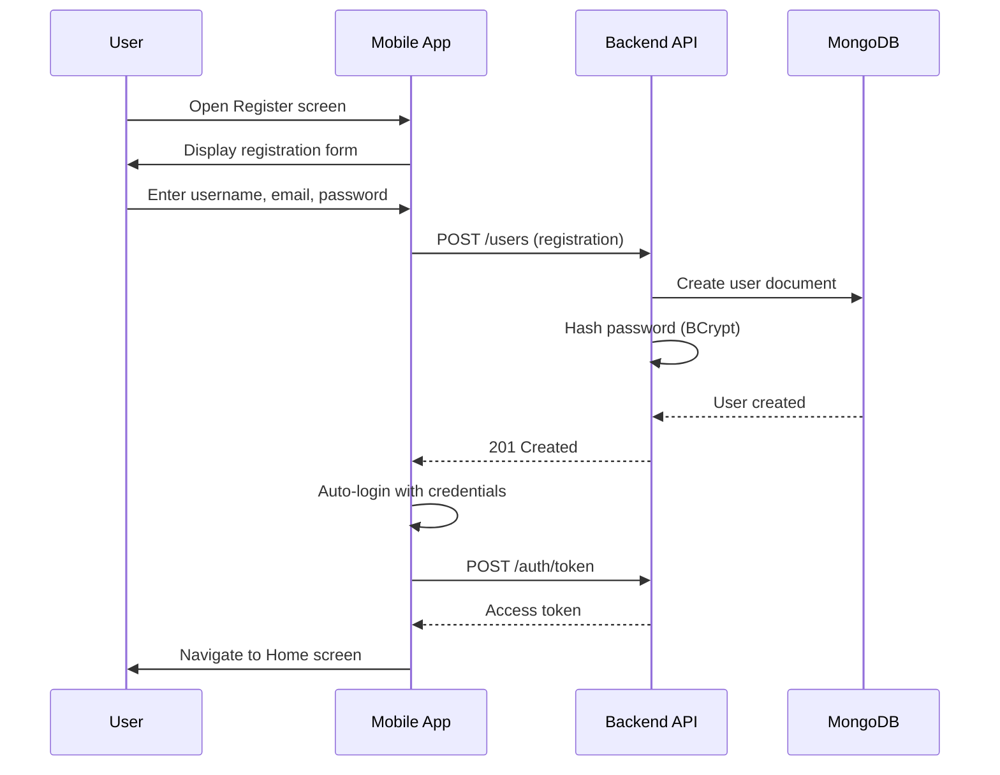
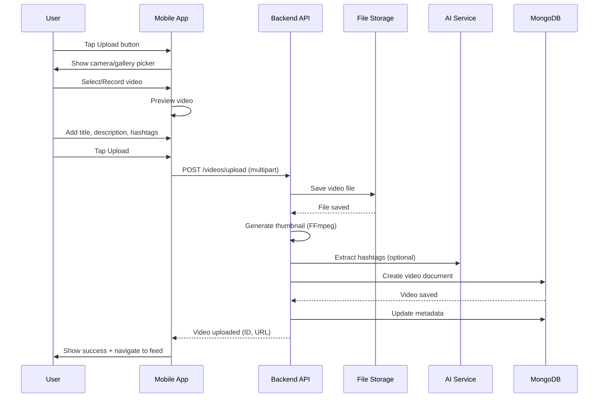
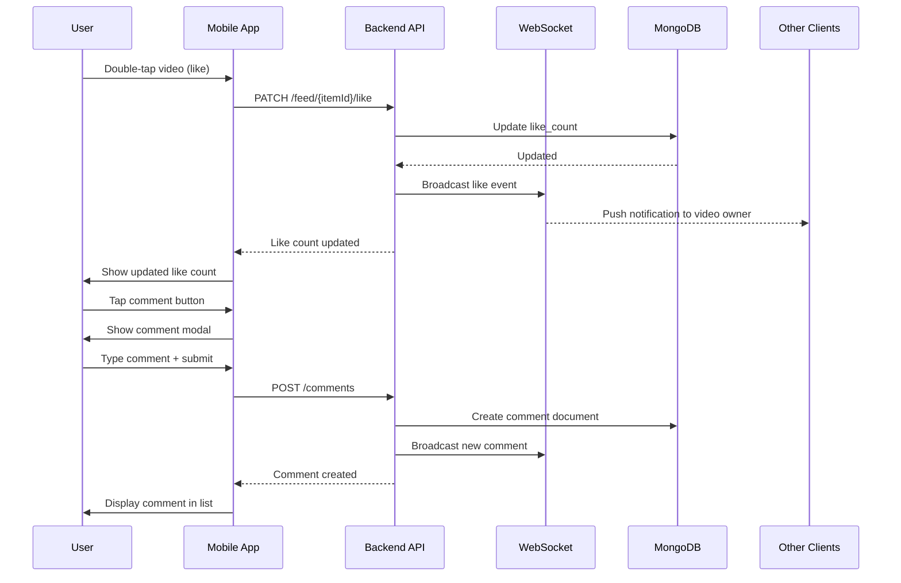
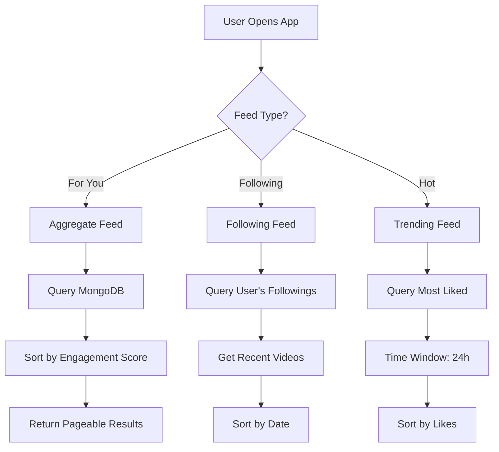
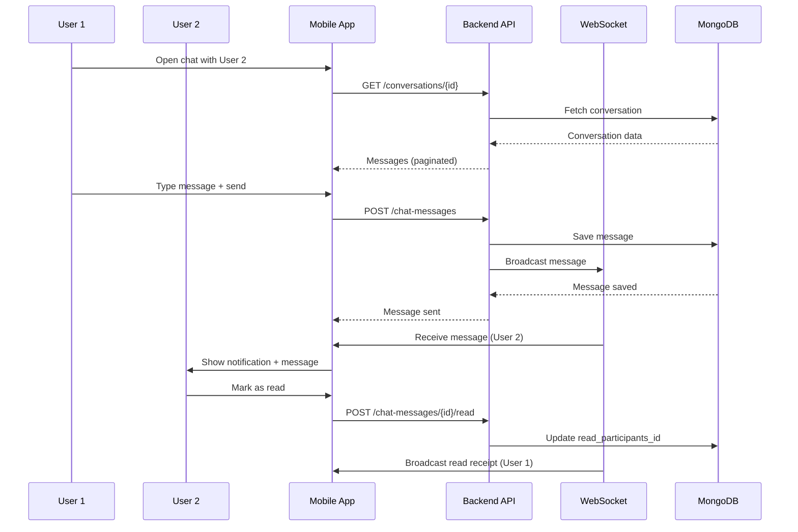
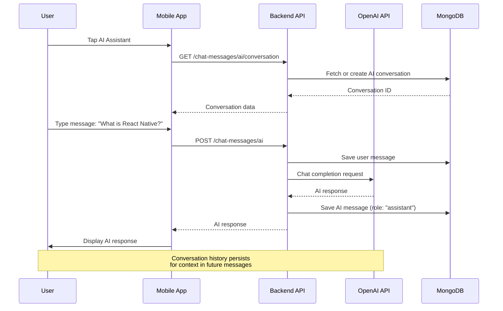

# User Workflows

> **Version**: 1.0
> **Last Updated**: 2025-01-27
> **Owner**: Product Team

## Table of Contents

- [User Registration and Onboarding](#user-registration-and-onboarding)
- [Content Creation Flow](#content-creation-flow)
- [Content Interaction Flow](#content-interaction-flow)
- [Search and Discovery](#search-and-discovery)
- [Messaging Flow](#messaging-flow)
- [AI Chat Assistant Flow](#ai-chat-assistant-flow)

## User Registration and Onboarding

### Registration Sequence

### Onboarding Steps

1. **Account Creation**

   - User enters username, email, password
   - Server validates uniqueness of username and email
   - Password is hashed and stored

2. **Profile Setup**

   - User is prompted to add profile picture
   - User can add display name and bio
   - Optional: Import contacts

3. **Content Recommendations**
   - First-time feed generation
   - Suggested users to follow
   - Trending content display

## Content Creation Flow

### Video Upload Workflow

### Upload Steps

1. **Video Selection**

   - User opens camera or gallery
   - Selects or records video (max 60 seconds)
   - Video is compressed if needed

2. **Video Processing**

   - Server receives video file
   - Generates thumbnail at 1-second mark
   - Extracts duration and metadata
   - Stores in `/uploads/{user_id}/`

3. **Metadata Creation**

   - Creates video document in MongoDB
   - Links to uploader (UserDetail)
   - Associates hashtags
   - Creates FeedItem for discovery

4. **Distribution**
   - Video appears in user's profile
   - Added to feed algorithm
   - Notification to followers (optional)

## Content Interaction Flow

### Like/Comment/Share Flow

### Interaction Types

**Like**:

- Double-tap on video or tap like button
- Increment counter
- Broadcast to author via WebSocket
- Store in user's liked items

**Comment**:

- Open comment section
- Type comment text
- Optional: Reply to existing comment
- Store in nested structure

**Share**:

- Tap share button
- Choose platform (external apps)
- Track share_count in metadata
- Generate shareable link

## Search and Discovery

### Feed Algorithm Flow

### Discovery Mechanism

1. **For You Feed**

   - Aggregate all videos from all users
   - Sort by engagement score: `(likes × 2 + comments + shares) / age_in_hours`
   - Time decay: Recent content prioritized

2. **Following Feed**

   - Query videos from followed users only
   - Sort by creation date (newest first)

3. **Trending/Hot**
   - Videos with high engagement in last 24 hours
   - Formula: `(likes + comments × 2 + shares × 3) / views`

## Messaging Flow

### Direct Message Flow

### Real-time Messaging Features

**Message Delivery**:

- WebSocket connection per user
- Subscribe to user-specific queue: `/user/{userId}/queue/messages`
- Receive real-time message delivery

**Read Receipts**:

- Track read participants in message document
- Broadcast read status via WebSocket
- Update UI with read indicators

**Group Messaging**:

- Multiple participants in conversation
- Group-specific topics: `/topic/conversations/{id}`
- Admin controls: Add/remove members

## AI Chat Assistant Flow

### AI Chat Sequence

### AI Features

**Conversational Context**:

- Spring AI manages conversation memory
- Stores messages in MongoDB with role ("user" or "assistant")
- Context-aware responses

**Custom Prompts**:

- AI can answer questions about the app
- Provide user support
- Explain features and functionalities

**Session Management**:

- Each user has dedicated AI conversation
- Conversation ID preserved across sessions
- Memory persists across app restarts

## Related Documents

- [API_DOCUMENTATION.md](./API_DOCUMENTATION.md) - Endpoint reference
- [AUTHENTICATION_FLOW.md](./AUTHENTICATION_FLOW.md) - Authentication details

## Change Log

| Version | Date       | Changes         | Author       |
| ------- | ---------- | --------------- | ------------ |
| 1.0     | 2025-01-27 | Initial version | Product Team |
